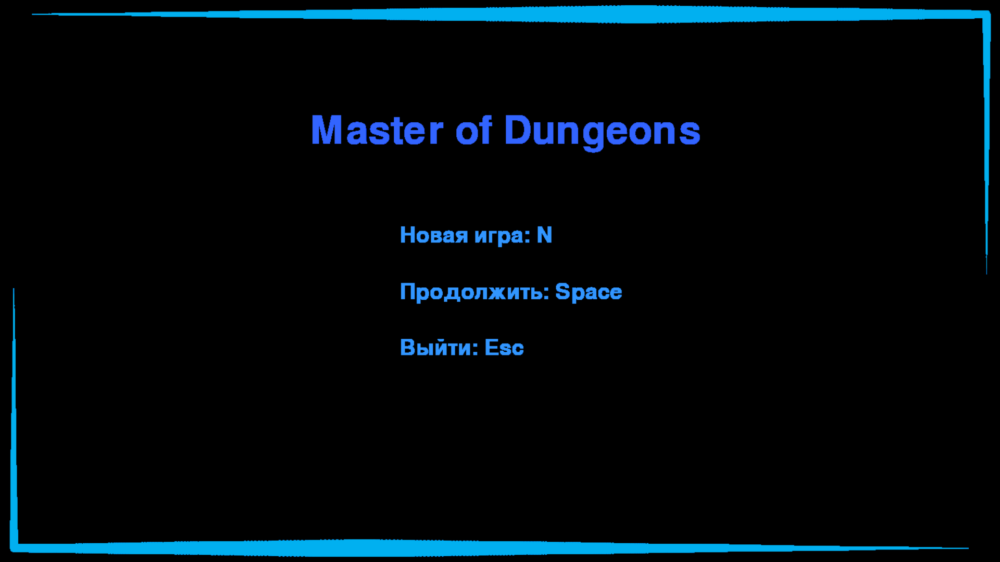
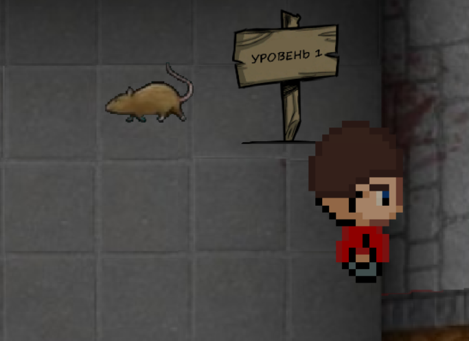

# Master of Dungen's

Игра, написанная на языке python, с использованием библиотеки pygame.

## Краткое описание

- **Анимации**
- **Головоломки**
- **Ходьба по комнотам**
- **Подсказки**
- Много уровней _(Скоро)_
- Выбор персонажа _(Скоро)_

## Поддерживаемые языки

- **Русский**
- Английский _(Скоро)_
- Немецкий _(Скоро)_

 

<h2 align="center">Предварительный просмотр</h2>

 

 
